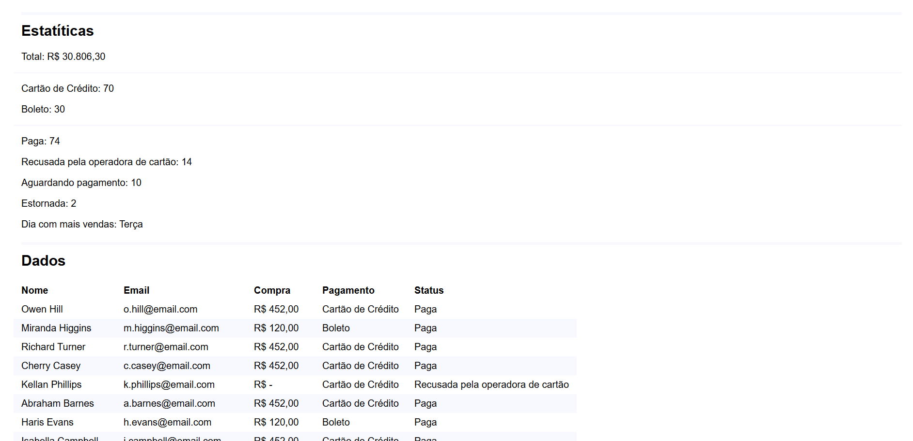

# Manipulando Dados

> TypeScript para Iniciantes

Projeto construído no curso de TypeScript para Iniciantes da Origamid.

[🔗 Clique aqui para acessar a página](https://ronald-ca.github.io/Manipulando_dados/)

## 📌 Tecnologias

- TypeScript
- HTML
- CSS
- Git e GitHub

## 📫 Contato

ronaldcamargodev@gmail.com 